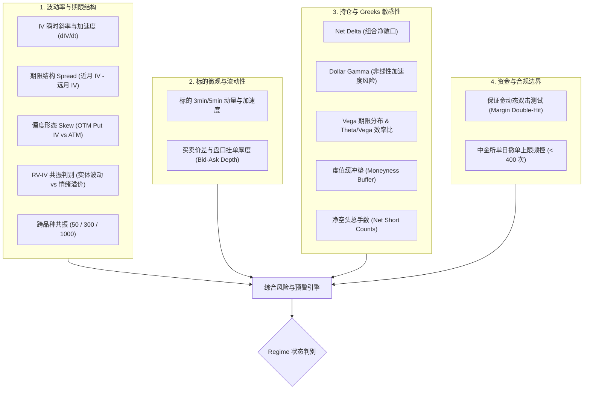
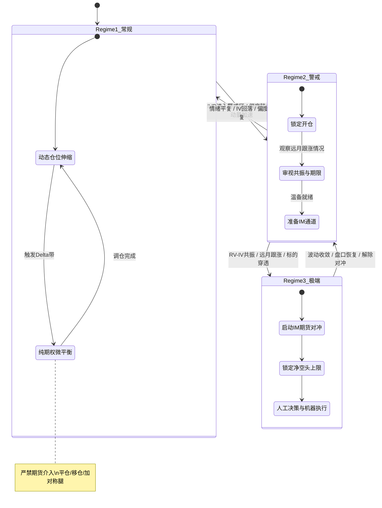
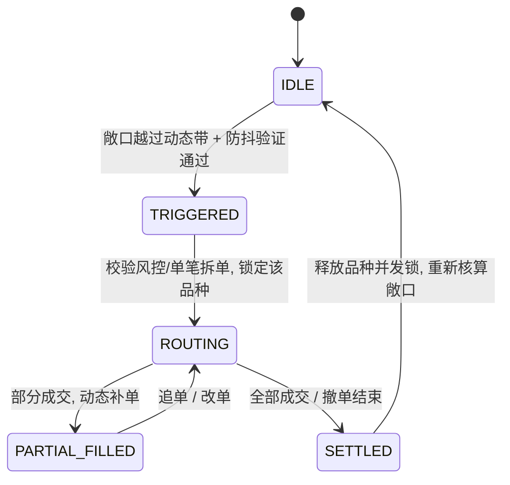
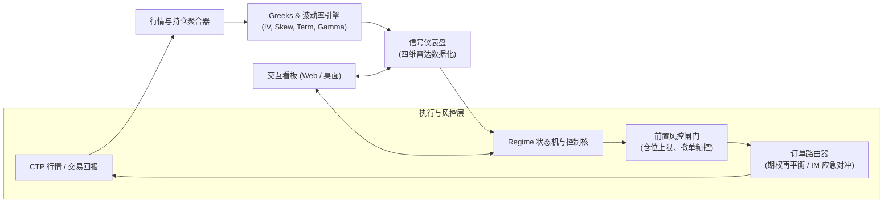

# MO期权监控与仓位控制系统设计方案

---

## 一、 系统定位与设计原则

### 1.1 适用标的与环境
* **核心期权标的**：中金所 MO（中证1000股指期权，合约乘数 100 元/点）。
* **应急对冲标的**：中金所 IM（中证1000股指期货，合约乘数 200 元/点）。
  * 换算基准：$1 \text{ 手 IM} \approx 2 \text{ 手 MO (按等效 Delta 换算)}$。
* **依托主系统**：`GreeksDashboard_v0.1` 架构，与实时行情推送、CTP 接口和风险引擎深度协同。

### 1.2 核心交易哲学与硬性原则
1. **非钟形分布与正相关仓位控制**：
   * 波动率并非对称正态分布，不采用盲目假设均值回归的固定阈值。
   * **常规行情下，仓位规模与波动率正相关**：IV 处于合理较高位置时，权利金更厚、安全边际更高，允许适度增大持仓规模；低 IV 时权利金过薄，控制并缩减仓位。
2. **分级工具边界（期货 vs 期权）**：
   * **常规行情**：严禁使用期货，仅通过纯期权调仓（平仓、移仓、加对称腿）平抑 Delta 和控制 Gamma。
   * **极端行情**：允许且必须启动 IM 期货进行毫秒级 Delta 锁定对冲。
3. **临期强制移仓**：
   * 到期时间 $DTE < 5$ 个交易日的合约，因 Pin Risk（归零/实值突变风险）及 Gamma 尖刺，严禁持有卖方空头，强制平仓或展期至次月。
4. **决策权边界（人机协同）**：
   * **常规微调**：系统自动化辅助计算与报单。
   * **极端防御**：**“数据清晰呈现、人做定性决策、机器高速执行”**。机器提供一键 IM 锁定、一键砍仓与风控预警，杜绝在极端行情下失控乱下。
5. **参数零假定**：
   * 框架预留标准化参数槽位，具体阈值由实盘经验输入，不硬编码任何经验假定。

---

## 二、 四维雷达监控体系（信号与风险指标）



### 2.1 波动率与期限结构微观指标
* **IV 变化斜率与加速度（$\frac{dIV}{dt}, \frac{d^2IV}{dt^2}$）**：
  * 计算高频窗口（如 1min / 3min / 5min）内主力平值 IV 的一阶导与二阶导。
  * 识别突发脉冲式拉升（恐慌踩踏启动信号）。
* **期限结构形态（Term Structure Spread）**：
  * $\Delta IV_{term} = IV_{near} - IV_{far}$。
  * **短端脉冲**（$\Delta IV_{term}$ 骤增）：局部情绪性溢价，多为脉冲性脉冲，大概率有回落均值修复机会。
  * **远端跟涨**（远月 IV 同步明显抬升）：跨期风险外溢，悲观预期长周期发酵，严禁盲目加空。
* **偏度结构动态（Skew Dynamics）**：
  * 跟踪虚值认沽对平值认购的偏度差：$Skew_{put} = IV_{OTM\_Put} - IV_{ATM}$。
  * 重点监控 Put 偏度斜率的非线性陡峭化，识别单边防踩踏情绪。
* **RV 与 IV 的共振关系（真恐慌 vs 情绪泡沫）**：
  * 计算标的日内实时 Realized Volatility（如 5min 收益率计算的短周期 RV）对比 Implied Volatility（IV）。
  * **类型 A（情绪泡沫）**：IV 飙升，但标的 RV 滞后平缓 $\to$ 纯情绪溢价，属于卖方高胜率加厚利润垫窗口。
  * **类型 B（真破位踩踏）**：标的实体破位，RV 同步爆发拉升 $\to$ 真实黑天鹅/极端风险，立即转入防御。
* **跨品种同向共振（50 / 300 / 1000）**：
  * 联动追踪 IH/HO、IF/IO、IM/MO 的 IV 走势。
  * **三者同向共振暴涨**：宏观流动性冲击或系统性β事件，全市场防御。
  * **仅 MO 独立异动**：中小盘特有生态（DMA、量化挤兑、流动性断层），针对性处理 MO。

### 2.2 标的微观走势与流动性
* **标的短期动量与斜率**：3min / 5min 级别均线加速度，警惕急跌急涨破位。
* **盘口冲击与滑点预警**：
  * 实时跟踪盘口 Bid-Ask Spread 与前五档累计挂单量。
  * 当流动性收缩、点差显著扩大时，阻断大单市价/对价报单，启动冰山或被动挂单。

### 2.3 持仓与 Greeks 动态敏感性
* **Net Delta**：组合整体方向性敞口（换算为标的金额与等效期货手数）。
* **Dollar Gamma**：
  $$\text{Dollar Gamma} = \frac{1}{2} \times \text{Net Gamma} \times S^2 \times 0.01^2$$
  标的变动 1% 时组合 Delta 的非线性激增量，重点关注平值集中度。
* **Vega 期限分布 & Theta/Vega 效率比**：
  * 评估各月份 Vega 集中风险，计算日间 Theta 收入对 IV 波动跳涨的抵抗倍数。
* **虚值缓冲垫（Moneyness Buffer）**：
  * 监控各卖方腿离标的现价的档位间距（Delta 绝对值 $\le 0.15$ 或离现价 $X$ 个档位）。
  * 当任一空头腿被逼近平值（Delta 绝对值进入 $> 0.30$ 区间）时触发防御预警。
* **净空头总手数（Net Short Contracts）**：
  * 绝对物理敞口，防范极端行情下的黑天鹅杀伤。

### 2.4 资金与合规边界
* **保证金动态双击（Margin Double-Hit 压力测试）**：
  * 模拟在标的单边跳空 $3\%$ 同时 IV 暴涨 $15$ 个点时的保证金暴增与浮亏叠加情况。
  * 测算“可用资金安全缓冲垫”，设定警戒红线。
* **交易所合规频控**：
  * 中金所单日单合约撤单上限（严格控制在 400 次红线之内，系统设安全裕度）。

---

## 三、 三阶段 Regime 状态机与控制策略



### 3.1 Regime 1: 常规行情（常规波动率区间）
* **核心目标**：赚取稳定时间价值，动态消化方向性微扰动。
* **仓位控制规则**：
  * **仓位与 IV 正相关**：在常规区间内，IV 处于高位时增厚卖方仓位；IV 处于低位时压缩底仓。
  * **期限约束**：$DTE < 5$ 天强制离场。
* **调仓执行规则**：
  * **纯期权调仓**：严禁动用 IM 期货。
  * **非对称动态带（Asymmetric Volatility Band）**：调仓容忍带随 IV/ATR 动态浮动，而非静态点位。
  * **优先路径**：
    1. 浮盈腿或深虚腿平仓释放保证金；
    2. 承受压力的单腿向更外档（更虚）或次月移仓（Roll Out / Roll Down）；
    3. 补充对称腿恢复 Delta 中性。

### 3.2 Regime 2: 警戒行情（波动率高位，如 IVP 80~90）
* **核心目标**：防范情绪扩散，切断被动加杠杆。
* **控制规则**：
  * **开仓通道拦截**：自动切入 **只减不增（Reduce-Only）** 模式，禁止同月份同价位追加空头。
  * **展期疏导**：若增厚保证金，必须要求移向远月以分摊 Gamma 尖刺。
  * **对冲通道温备**：CTP 期货交易通道建立连接、预热 IM 账户与可用资金，准备应对跳空。

### 3.3 Regime 3: 极端行情（波动率脉冲/极端破位，如 IVP > 90 或 RV-IV 同步暴走）
* **核心目标**：保全本金生存，毫秒级锁死方向性亏损放大。
* **控制规则**：
  * **硬上限强制截断**：净空头总手数触碰硬上限，绝对禁止新开任何卖方腿。
  * **IM 期货快速对冲**：
    * 计算公式：$\text{Target IM Lots} = -\text{Round}\left(\frac{\text{Net Delta}_{MO}}{2}\right)$。
    * 一键触发对冲，瞬间消除组合净 Delta 敞口。
  * **远月分化处理**：
    * **若远月未跟涨**：直接砍掉近月高风险受击腿，收缩整体净空头总数。
    * **若远月同步跟涨**：适度构建跨期日历/跨期熊市价差，用远月更厚的权利金吸收近月损失，同时规避近月 Gamma 爆炸。
  * **决策执行闭环**：
    * 机器毫秒级上报精确对冲方案及滑点预算。
    * 人工确认一键下发，支持一键“全品种 Delta 归零”、“单腿平仓”。

---

## 四、 调仓微结构与执行状态机



### 4.1 触发与防抖控制
1. **时间防抖（Time Debounce）**：
   * 敞口突破容忍带需持续稳定 $T$ 秒（如 3~5 秒），过滤闪崩、跳价或集合竞价脉冲。
2. **盘口质量校验**：
   * 买一/卖一价差小于预设阈值，且挂单量足以消化最小拆单手数。

### 4.2 执行模式与算法
* **常规期权调仓（Passive Maker 优先）**：
  * 优先以买一/卖一被动挂单等待成交，节省跨月/多腿调仓的摩擦成本。
  * 超过时间窗口未成交且盘口外移，自动撤改。
* **极端期货对冲（Aggressive Taker 追单）**：
  * 快速对冲模式直接对手价/超价 1 tick 发单，确保秒级成交锁定风险。
* **合规撤单计数守卫**：
  * 进程内维护单日各合约撤单计数器，临近 350 次时自动提升挂单驻留容忍度或降级为纯人工审批。

---

## 五、 系统模块架构与数据流



### 5.1 与现有 `GreeksDashboard_v0.1` 的集成
* **继承扩展**：复用现有的 `vnpy_engine.py` 基础连接、实时 Tick 行情订阅、持仓查询与快照体系。
* **核心升级项**：
  1. `risk_engine`：扩展高频 IV 变化斜率、RV 实时流式计算、期限 Spread 计算与跨品种联动接口。
  2. `strategy_engine`（新增）：维护 MO 品种的状态机、动态容忍带计算、期权调仓指令生成及 IM 对冲计算。
  3. `ui_dashboard`：增加“MO 波动率与恐慌雷达面板”及“应急对冲指令控制台”。

---

## 六、 核心配置与参数模板（标准化预留）

为遵循“不假定参数数值”的原则，系统统一通过配置文件预留参数槽位：

```json
{
  "mo_position_control": {
    "capital_and_limits": {
      "base_position_lots": null,
      "max_net_short_options": null,
      "max_dollar_gamma": null,
      "max_single_clip_lots": null,
      "dte_force_close_days": 5
    },
    "regime_thresholds": {
      "ivp_caution_band": [80, 90],
      "ivp_extreme_band": 90,
      "iv_slope_spike_threshold": null,
      "put_skew_steep_threshold": null
    },
    "rebalance_bands": {
      "delta_tolerance_band": null,
      "debounce_time_seconds": 3,
      "max_spread_ticks_allowed": 2
    },
    "extreme_hedge": {
      "im_hedge_enabled": true,
      "im_to_mo_ratio": 2.0,
      "aggressive_tick_offset": 1
    }
  }
}
```

---

## 七、 后续落地实施路径

1. **第一阶段：信号雷达与数据层落地**
   * 在当前 Greeks 计算基础上，完善 IV 变化斜率、近远月 IV Spread、RV 实时计算以及 50/300/1000 共振指标输出。
2. **第二阶段：看板可视化呈现**
   * 在 Web 看板增加 6 屏雷达视图对应的数据卡片（斜率、偏度、共振、敞口集中度）。
3. **第三阶段：状态机与建议指令生成（只出建议不下单）**
   * 实现三阶段 Regime 判别逻辑，实时计算推荐调仓手数与对冲手数，供人工交叉验证。
4. **第四阶段：受控执行与风控闭环**
   * 接入 CTP 交易执行接口，实现带有审批模式的期权调仓与 IM 应急对冲。
